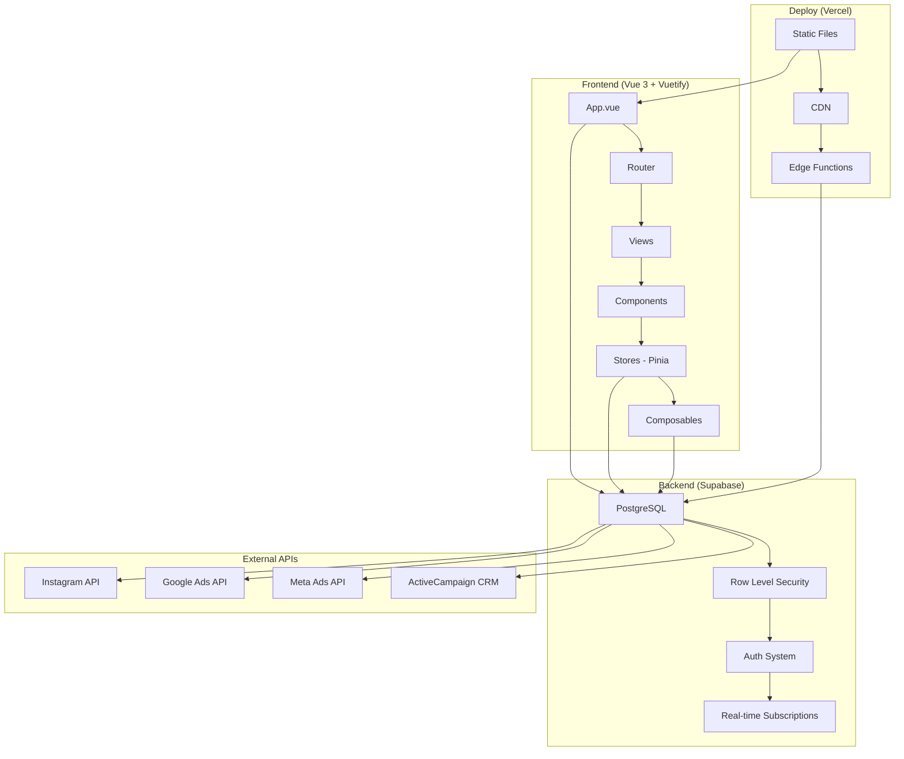
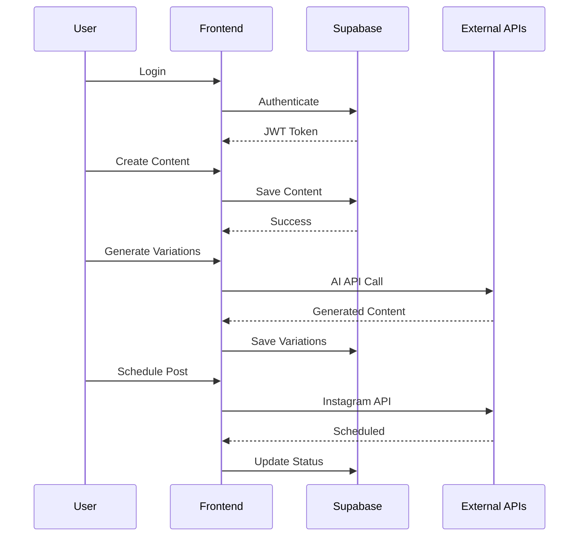
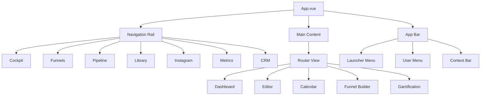
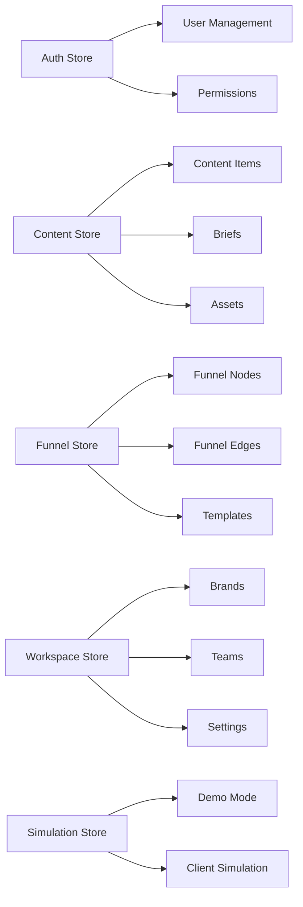
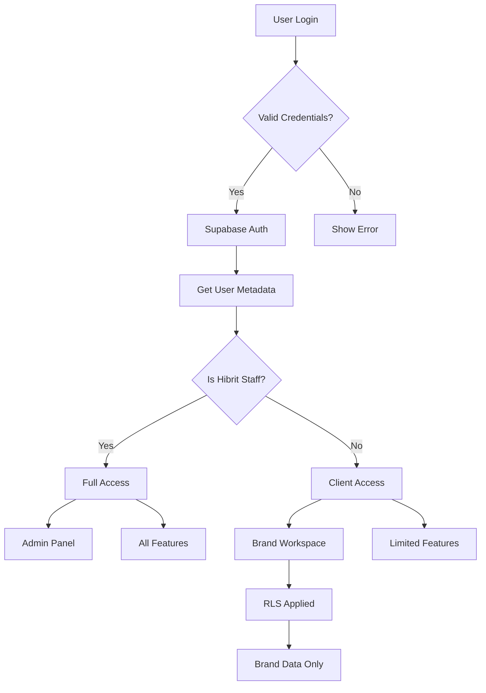
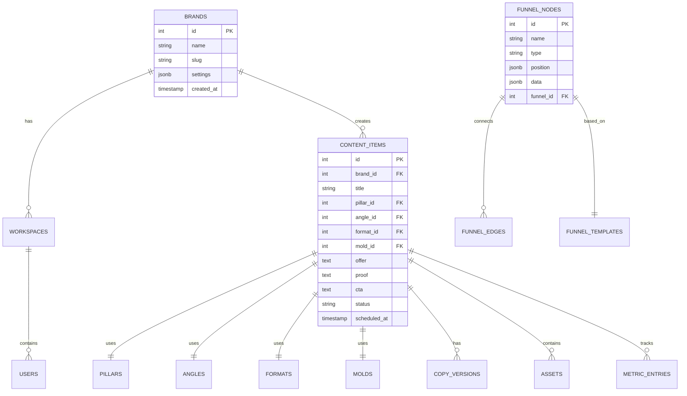
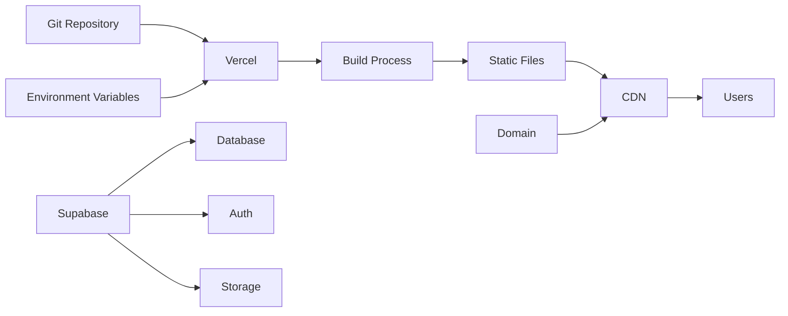
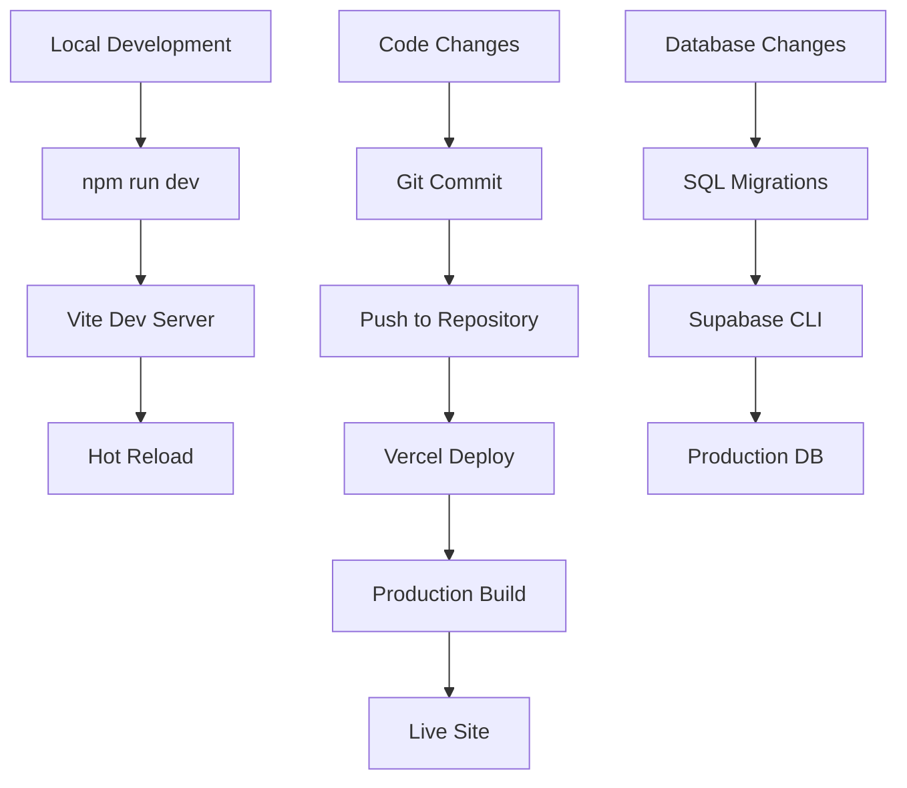
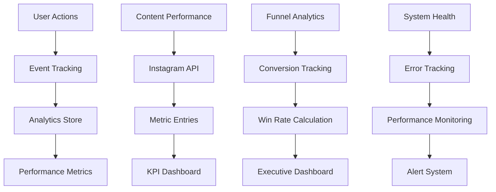

# Arquitetura do Sistema HBT Content Strategist

## Diagrama de Arquitetura



## Fluxo de Dados



## Estrutura de Componentes



## Sistema de Stores (Pinia)



## Fluxo de Autenticação



## Sistema de Roteamento

```mermaid
graph TD
    A[/] --> B[/cockpit]
    
    B --> C[/cockpit/ocs]
    B --> D[/content-center]
    B --> E[/funnel-center]
    
    F[/pipeline] --> G[/editor/:id]
    H[/library] --> I[/metrics]
    J[/funnels] --> K[/funnels/:id]
    
    L[/labs] --> M[/labs/scientific-laboratories]
    L --> N[/labs/neural-research-engine]
    L --> O[/labs/interface-test]
    
    P[/admin] --> Q[/tasks]
    P --> R[/setup-admin]
    
    S[/channels/instagram] --> T[/channels/youtube]
    S --> U[/channels/blog]
    
    V[/gamification] --> W[/gamification/operacao-anti-ghosting]
```

## Estrutura de Banco de Dados



## Sistema de Deploy



## Fluxo de Desenvolvimento



## Monitoramento e Analytics


